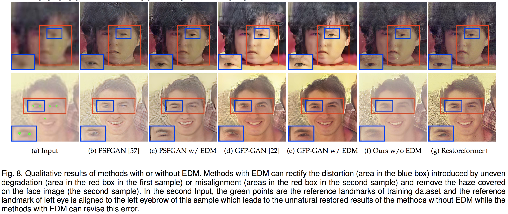

# Updating

- 20221120 Introducing the project.

# RestoreFormer++

This repo is the implement of our work "RestoreFormer++: Towards Real-World Blind Face Restoration from Undegraded Key-Value Paris" which is still under reviewed.

**RestoreFormer++** is an extension of our [**RestoreFormer**](https://openaccess.thecvf.com/content/CVPR2022/papers/Wang_RestoreFormer_High-Quality_Blind_Face_Restoration_From_Undegraded_Key-Value_Pairs_CVPR_2022_paper.pdf). It proposes to restore a degraded face image with both fidelity and realness by using the powerful fully-spacial attention mechanisms to model the abundant contextual information in the face and its interplay with our reconstruction-oriented high-quality priors. Besides, it introduces an extending degrading model (**EDM**) that contains more realistic degraded scenarios for training data synthesizing, which helps to enhance its robustness and generalization towards real-world scenarios. Our results compared with the state-of-the-art methods and performance with/without EDM are in following:

## Environment

- python>=3.7
- pytorch>=1.7.1
- pytorch-lightning==1.0.8
- omegaconf==2.0.0
- basicsr==1.3.3.4

**Warning** Different versions of pytorch-lightning and omegaconf may lead to errors or different results.

## Preparations of dataset and models

**Dataset**: 
- Training data: Both **ROHQD** and **RestoreFormer++** in our work are trained with **FFHQ** which attained from [FFHQ repository](https://github.com/NVlabs/ffhq-dataset). The original size of the images in FFHQ are 1024x1024. We resize them to 512x512 with bilinear interpolation in our work. Link this dataset to ./data/FFHQ/image512x512.
- <a id="testset">Test data</a>: [CelebA-Test](https://pan.baidu.com/s/1iUvBBFMkjgPcWrhZlZY2og?pwd=test), [LFW-Test](http://vis-www.cs.umass.edu/lfw/#views), [WebPhoto-Test](https://xinntao.github.io/projects/gfpgan), and [CelebChild-Test](https://xinntao.github.io/projects/gfpgan)

###  We will release our code and models in the near feature. Stay tuned
