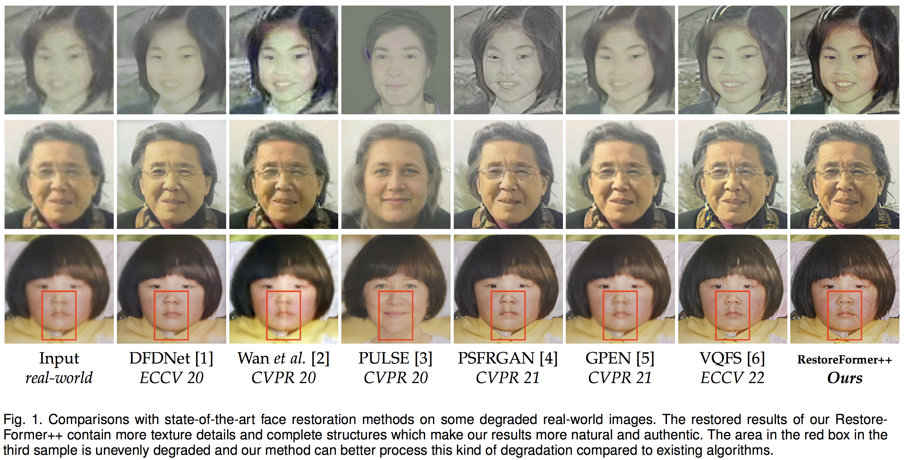
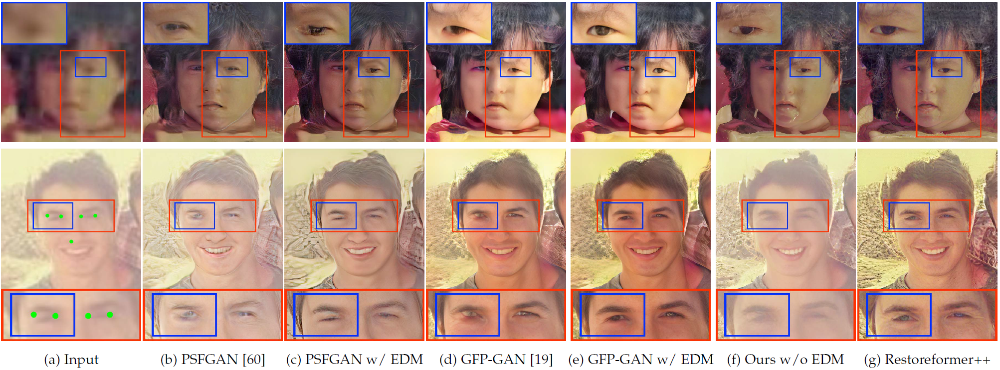

# RestoreFormer++: Towards Real-World Blind Face Restoration from Undegraded Key-Value Paris

[](https://openaccess.thecvf.com/content/CVPR2022/papers/Wang_RestoreFormer_High-Quality_Blind_Face_Restoration_From_Undegraded_Key-Value_Pairs_CVPR_2022_paper.pdf)
&nbsp; 
[](https://openaccess.thecvf.com/content/CVPR2022/papers/Wang_RestoreFormer_High-Quality_Blind_Face_Restoration_From_Undegraded_Key-Value_Pairs_CVPR_2022_paper.pdf)
&nbsp;
[](https://github.com/wzhouxiff/RestoreFormerPlusPlus)
&nbsp; 
[](https://github.com/wzhouxiff/RestoreFormer)
&nbsp;
[](https://huggingface.co/spaces/wzhouxiff/RestoreFormerPlusPlus)


This repo is a official implementation of "[RestoreFormer++: Towards Real-World Blind Face Restoration from Undegraded Key-Value Paris](https://arxiv.org/pdf/2308.07228.pdf)". 


[**RestoreFormer++**](https://arxiv.org/pdf/2308.07228.pdf) is an extension of our [**RestoreFormer**](https://openaccess.thecvf.com/content/CVPR2022/papers/Wang_RestoreFormer_High-Quality_Blind_Face_Restoration_From_Undegraded_Key-Value_Pairs_CVPR_2022_paper.pdf). It proposes to restore a degraded face image with both fidelity and realness by using the powerful fully-spacial attention mechanisms to model the abundant contextual information in the face and its interplay with our reconstruction-oriented high-quality priors. Besides, it introduces an extending degrading model (**EDM**) that contains more realistic degraded scenarios for training data synthesizing, which helps to enhance its robustness and generalization towards real-world scenarios. Our results compared with the state-of-the-art methods and performance with/without EDM are in following:





# ToDo List
- [x] 20240122 Provided local [gradio demo](#gradio_demo). 
- [x] 20230915 Update an online demo [](https://huggingface.co/spaces/wzhouxiff/RestoreFormerPlusPlus)
- [x] 20230915 Provide a user-friendly method for [inference](#inference).
    - It is avaliable for background SR with [RealESRGAN](https://github.com/xinntao/Real-ESRGAN).
    - **basicsr should be upgraded to 1.4.2**.
- [x] 20230914 Upload model
- [x] 20230914 Realse Code
- [x] 20221120 Introducing the project.

## Environment

- python>=3.7
- pytorch>=1.7.1
- pytorch-lightning==1.0.8
- omegaconf==2.0.0
- ~~basicsr==1.3.3.4~~ **basicsr>=1.4.2**
- realesrgan==0.3.0

```
pip install -r RF_requirements.txt
```
    
❗❗❗ **Warning** Different versions of pytorch-lightning and omegaconf may lead to errors or different results.

## Preparations of dataset and models

**Dataset**: 
- Training data: Both **ROHQD** and **RestoreFormer++** in our work are trained with **FFHQ** which attained from [FFHQ repository](https://github.com/NVlabs/ffhq-dataset). The original size of the images in FFHQ are 1024x1024. We resize them to 512x512 with bilinear interpolation in our work. Link this dataset to ./data/FFHQ/image512x512.
- <a id="testset">Test data</a>: [CelebA-Test](https://pan.baidu.com/s/1iUvBBFMkjgPcWrhZlZY2og?pwd=test), [LFW-Test](http://vis-www.cs.umass.edu/lfw/#views), [WebPhoto-Test](https://xinntao.github.io/projects/gfpgan), and [CelebChild-Test](https://xinntao.github.io/projects/gfpgan)

**Model**: 
Both pretrained models used for training and the trained model of our RestoreFormer and RestoreFormer++ can be attained from [Google Driver](https://drive.google.com/drive/folders/1-WPxGJu8CK6SjprJSD4Mvm2zQH9J7xCU?usp=drive_link). Link these models to ./experiments.


<h2 id='gradio_demo'> Gradio Demo</h2>
    
    python gradio_demo/app.py

<!-- ## <a id="metrics">Metrics</a> -->
<h2 id="inference">Quick Inference</h2>

    python inference.py -i data/aligned -o results/RF++/aligned -v RestoreFormer++ -s 2 --aligned --save
    python inference.py -i data/raw -o results/RF++/raw -v RestoreFormer++ -s 2 --save
    python inference.py -i data/aligned -o results/RF/aligned -v RestoreFormer -s 2 --aligned --save
    python inference.py -i data/raw -o results/RF/raw -v RestoreFormer -s 2 --save

**Note**: Related codes are borrowed from [GFPGAN](https://github.com/TencentARC/GFPGAN). 

## Test
    sh scripts/test.sh

scripts/test.sh

    exp_name='RestoreFormer'
    exp_name='RestoreFormerPlusPlus'

    root_path='experiments'
    out_root_path='results'
    align_test_path='data/aligned'
    # unalign_test_path='data/raw'
    tag='test'

    outdir=$out_root_path'/'$exp_name'_'$tag

    if [ ! -d $outdir ];then
        mkdir -m 777 $outdir
    fi

    CUDA_VISIBLE_DEVICES=0 python -u scripts/test.py \
    --outdir $outdir \
    -r $root_path'/'$exp_name'/last.ckpt' \
    -c 'configs/'$exp_name'.yaml' \
    --test_path $align_test_path \
    --aligned


- This codebase is available for both **RestoreFormer** and **RestoreFormerPlusPlus**. Determinate the specific model with *exp_name*.
- Setting the model path with *root_path*
- Restored results are save in *out_root_path*
- Put the degraded face images in *test_path*
- If the degraded face images are aligned, set *--aligned*, else remove it from the script. The provided test images in data/aligned are aligned, while images in data/raw are unaligned and contain several faces.

## Training
    sh scripts/run.sh

scripts/run.sh

    export BASICSR_JIT=True

    # For RestoreFormer
    # conf_name='HQ_Dictionary'
    # conf_name='RestoreFormer'

    # For RestoreFormer++
    conf_name='ROHQD'
    conf_name='RestoreFormerPlusPlus'

    # gpus='0,1,2,3,4,5,6,7'
    # node_n=1
    # ntasks_per_node=8

    root_path='PATH_TO_CHECKPOINTS'

    gpus='0,'
    node_n=1
    ntasks_per_node=1

    gpu_n=$(expr $node_n \* $ntasks_per_node)

    python -u main.py \
    --root-path $root_path \
    --base 'configs/'$conf_name'.yaml' \
    -t True \
    --postfix $conf_name'_gpus'$gpu_n \
    --gpus $gpus \
    --num-nodes $node_n \
    --random-seed True \

- This codebase is available for both **RestoreFormer** and **RestoreFormerPlusPlus**. Determinate the training model with *conf_name*. 'HQ_Dictionary' and 'RestoreFormer' are for **RestoreFormer**, while 'ROHQD' and 'RestoreFormerPlusPlus' are for **RestoreFormerPlusPlus**.
- While training 'RestoreFormer' or 'RestoreFormerPlusPlus', *'ckpt_path'* in the corresponding configure files in configs/ sholud be updated with the path of the trained model of 'HQ_Dictionary' or 'ROHQD'.

<!-- ## <a id="metrics">Metrics</a> -->
## Metrics
    sh scripts/metrics/run.sh
    
**Note**. 
- You need to add the path of CelebA-Test dataset in the script if you want get IDD, PSRN, SSIM, LIPIS.
- Related metric models are in *./experiments/pretrained_models/*

## Citation
    @article{wang2023restoreformer++,
      title={RestoreFormer++: Towards Real-World Blind Face Restoration from Undegraded Key-Value Paris},
      author={Wang, Zhouxia and Zhang, Jiawei and Chen, Tianshui and Wang, Wenping and Luo, Ping},
      booktitle={IEEE Transactions on Pattern Analysis and Machine Intelligence (T-PAMI)},
      year={2023}
    }

    @article{wang2022restoreformer,
      title={RestoreFormer: High-Quality Blind Face Restoration from Undegraded Key-Value Pairs},
      author={Wang, Zhouxia and Zhang, Jiawei and Chen, Runjian and Wang, Wenping and Luo, Ping},
      booktitle={The IEEE Conference on Computer Vision and Pattern Recognition (CVPR)},
      year={2022}
    }

<!-- ## Acknowledgement
We thank everyone who makes their code and models available, especially [Taming Transformer](https://github.com/CompVis/taming-transformers), [basicsr](https://github.com/XPixelGroup/BasicSR), and [GFPGAN](https://github.com/TencentARC/GFPGAN). -->

## Contact
For any question, feel free to email `wzhoux@connect.hku.hk` or `zhouzi1212@gmail.com`.
